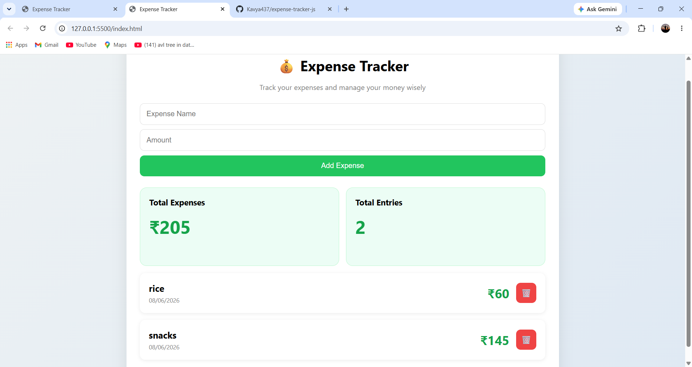

# Expense Tracker

A simple expense tracking web application built using HTML, CSS, and JavaScript.

## Features

- Add expenses
- Delete expenses
- Track total expenses
- Track total entries
- LocalStorage support
- Clean dashboard UI

## Technologies Used

- HTML
- CSS
- JavaScript

## Screenshot

